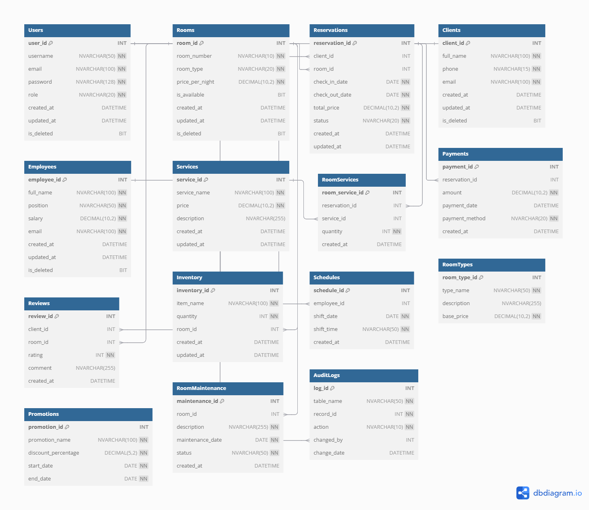
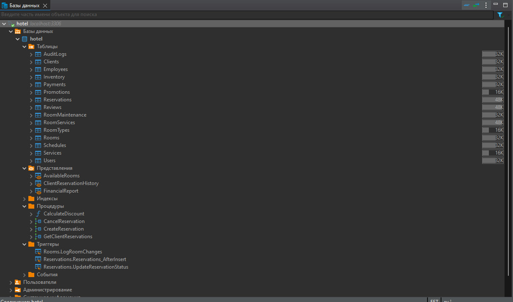

# Hotel Management Database

## Опис проекту

Повнофункціональна база даних для управління готелем, розроблена з використанням MySQL та Docker. Система включає повний цикл управління номерами, бронюваннями, клієнтами, співробітниками, послугами та фінансовими операціями.

## Технології

- **MySQL** – основна база даних
- **Docker** – контейнеризація та розгортання
- **SQL** – створення структури та логіки бази даних

## Можливості системи

- Управління користувачами з різними ролями
- Бронювання та скасування номерів
- Облік клієнтів та співробітників
- Додаткові послуги готелю
- Система знижок та акцій
- Фінансовий облік
- Аудит змін

## Структура бази даних

### Розроблена схема бази даних 
В dbdiagram.io
https://dbdiagram.io/d/hotel-67409e71e9daa85aca65314d


Запущенна база даних в DBeaver:



### Основні таблиці
- `Users` – користувачі системи
- `Rooms` – номери готелю
- `Reservations` – бронювання
- `Clients` – інформація про клієнтів
- `Employees` – співробітники
- `Services` – додаткові послуги
- `Payments` – оплати
- `Reviews` – відгуки клієнтів

### Додаткові таблиці
- `Inventory` – облік інвентарю
- `Schedules` – графіки роботи
- `RoomTypes` – типи номерів
- `Promotions` – знижки
- `RoomMaintenance` – технічне обслуговування
- `AuditLogs` – журнал аудиту

## Швидкий старт

### Вимоги
- Docker
- Docker Compose

### Інсталяція

1. Клонуйте репозиторій
```bash
git clone https://github.com/your-username/hotel-management-db.git
cd hotel-management-db
```

2. Запустіть Docker-контейнер
```bash
docker-compose up
```

3. Підключіться до бази даних
- **Хост:** localhost
- **Порт:** 3306
- **Користувач:** user
- **Пароль:** password
- **База даних:** hotel

## Основні функції

### Процедури
- `CreateReservation` – створення бронювання
- `CancelReservation` – скасування бронювання
- `GetClientReservations` – отримання бронювань клієнта
- `UpdateReservationStatuses` - оновлення статусів бронювання по даті

### Функції
- `CalculateDiscount` – розрахунок знижки

### Тригери
- `LogRoomChanges` – логування змін номерів
- `Reservations_AfterInsert`- логування змін бронювання
### Представлення (Views)
- `AvailableRooms` – перелік доступних номерів
- `ClientReservationHistory` – історія бронювань
- `FinancialReport` – фінансовий звіт

## Приклад використання

### Створення бронювання
```sql
CALL CreateReservation(1, 101, '2024-12-01', '2024-12-05');
```

### Отримання доступних номерів
```sql
SELECT * FROM AvailableRooms;
```
